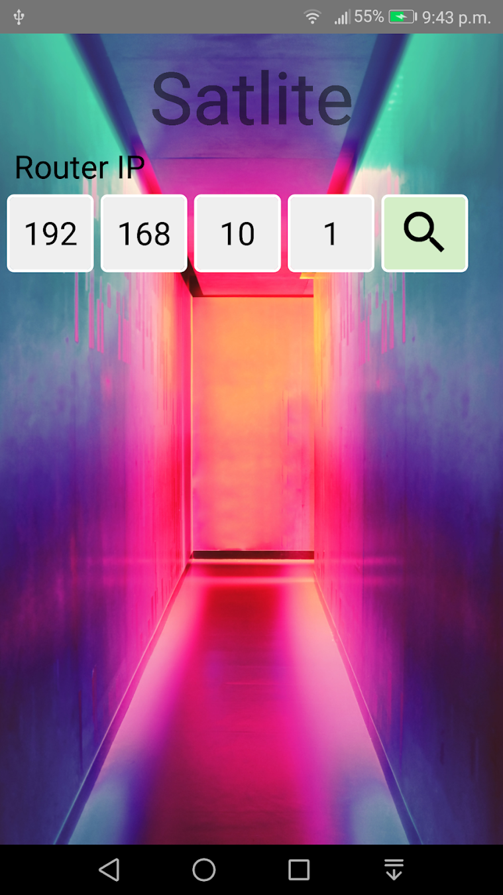

# Satlite

If your set top box comes with TV WebServer then you can stream your channels via Satline to your mobile phone.

Any device that as TV WebServer pre-installed should be able to use Satline.

**Satlite** was tested with** Amiko A4K** and **Amiko A5**.

If you connect a **OpenVPN** for example on your home network you will be able to stream content from your house to your location.

Download the app at https://play.google.com/store/apps/details?id=com.satline

